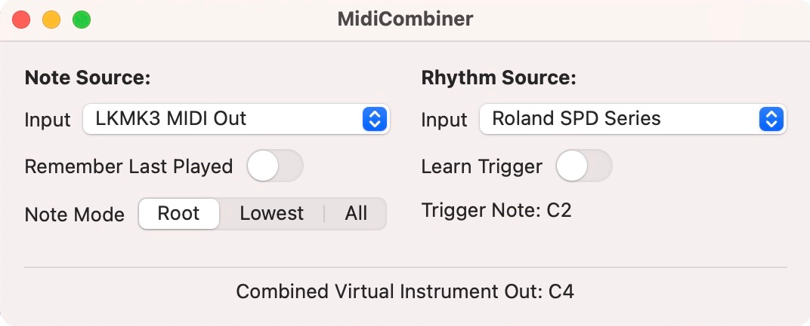

# MidiCombiner for Mac

Combines inputs from 2 different MIDI sources: A note source and a rhythm source to create a new virtual MIDI instrument. The note source determines which note the new instrument will play, and the rhythm source determines when the new instrument will send that note.

Uses Swift UI, [AudioKit](https://audiokit.io/), and [ChordRecGen](https://github.com/derrickward/ChordRecGen).

TODO:

- [ ] combine midi messages and send to virtual device on the background thread that recieves the message
